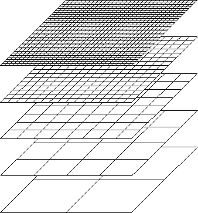
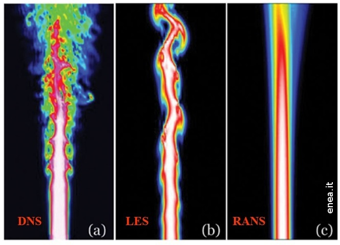

<h1 class="post-title">Research</h1>
My Ph.D. research was primarily focused on multi-fidelity methods for speeding up inference in uncertainty quantification (UQ) with applications to scientific computing and machine learning.

<h1 class="post-title">Introduction</h1>
Many problems across computational science, engineering, and machine learning involve the use of a model $$G: \Theta \to \mathcal{Y}$$ for some underlying process that relates model parameters $$\theta$$ to observables $$\mathbf{y}$$.
For example, $$\theta$$ could be the thermal conductivity of a metal plate and $$\mathbf{y}$$ the temperature measurements at different fixed points throughout the plate.
The model $$G$$, also referred to as the "forward model" or "parameter-to-observable map" depending on the context, maps the thermal conductivity to the temperature at the observation points (assuming appropriate boundary conditions) and requires solving an underlying partial differential equation (PDE).
In the case of this example, the heat equation.
Except for in special cases where the underlying differential equation has an analytical solution, evaluating the forward model $$G$$ may not be possible.
Instead, a high-fidelity numerical model $$G^{(L)}:\Theta \to \mathcal{Y}$$ is used to approximate the true model $$G$$, with the superscript $$L$$ denoting the accuracy or fidelity of the model.

While the high-fidelity model can often be made arbitarily accurate, for example by refining the size of the grid used to discrtize the PDE, evaluation may incur a significant computational cost (e.g. measured in runtime, memory use, dollars, energy consumption, etc.). 
However, many ubiquitous tasks in computational science and engineering applications require evaluating the high-fidelity model repeatedly for different inputs.
These tasks are referred to as "outer-loop" applications and can still be computationally intractable if the cost of evaluating the high-fidelity model is significant. 
Examples of such outer-loop applications include:
- **Optimization**: Many optimization methods iteratively update a set of design variables to minimize an objective function that depends on the high-fidelity model by evaluating its derivatives.
- **Inference**: Inferring a quantity of interest, e.g. the mean or variance, from a probability distribution via Monte Carlo methods typically requires repeated evaluations of the log density or its gradient to draw samples.
- **Data assimilation**: Filtering-based methods that integrate observational data into existing models typically alternate between a prediction step where the model is eval- uated and an update step where the model parameters are adjusted to reflect the new data.
- **Control**: Controlling a system to a desired state with feedback requires monitoring the system by evaluating the model for the system and adjusting the control variables accordingly.

The simplest approach to circumvent these high computational costs is to simply use a cheaper, but less accurate, numerical model.
In other words, *replacing* the high-fidelity model with a surrogate model.
Typical examples of surrogate models used in practice are shown below.

<figure class="right" style="float:left">
    <figcaption><b>course grid approximations</b></figcaption>
    
</figure>
<figure class="right" style="float:right">
    <figcaption><b>machine learning and data-fit models</b></figcaption>
    
</figure>

 

<figure class="right" style="float:left">
    <figcaption><b>reduced order models</b></figcaption>
    
</figure>
<figure class="right" style="float:right">
    <figcaption><b>simplified physics and linearized models</b></figcaption>
    
</figure>

 

While more tractable, replacing the high-fidelity model with a surrogate model introduces an error in final outer-loop result (for example by minimizing a surrogate objective function or sampling from a surrogate density).

Multi-fidelity methods  are designed to use both the high-fidelity and surrogate models together.
Good multi-fidelity methods will maintain the accuracy of the high-fidelity model while offloading the bulk of the computation in the outer-loop to cheaper surrogate models in order to achieve speedups and reduce overall cost.
A special case of multi-fidelity methods is when the surrogate models form a clear hierarchy, such as in the case of nested grids or reduced order models, and is referred to as multilevel methods.
The sections that follow focus specifically on multi-fidelity methods for inference in uncertainty quantification.

# Multi-fidelity methods for UQ

Generally speaking there are two flavors of uncerainty quantification depending on which quantity, either the parameters $$\theta$$ or the observables $$\mathbf{y}$$, is treated as the source of randomness.

- **Forward UQ** treats the underlying parameters as random and is concerned with the distribution of the model output $$G^{(L)}(\theta)$$.
- **Inverse UQ** models the observed data $$\mathbf{y}$$ as random and seeks to infer the corresponding parameters $$\theta$$, typically through sampling the posterior distribution $$p(\theta \mid \mathbf{y})$$.

## **Forward UQ**

For this setting, let $$\theta \sim \pi_0$$ and $$\mathbf{y} = G^{(L)}(\theta)$$ be distributed according to the pushforward distribution $$\pi^{(L)} = G^{(L)}_{\#}\pi_0$$.
The goal here is to evaluate statistics of the distribution $$\pi^{(L)}$$ such as the mean, covariance, or probabilities (especially rare event probabilities).
Because expectation amounts to integration, for high-dimensional parameters the standard approach is to use Monte Carlo methods.

Two distinct examples of multi-fidelity methods for forward UQ are the multi-fidelity cross-entropy method (MFCE)  and multi-fidelity control variates (MFCV) .

### Multi-fidelity cross-entropy method
The multi-fidelity cross-entropy method specializes in estimating rare event probabilities of the form

$$
    p_t = \mathbb{E}\left[ \mathbf{1}\{ G^{(L)}(\theta)  > t \} \right] ,
$$

where $$t \in \mathbb{R}$$ denotes some threshold.
To estimate $$p_t$$, the cross-entropy method searches for a suitable biasing density to be used for importance sampling.
Given a family $$\mathcal{P}$$ of probability distributions, typically normal distributions, the cross-entropy method starts with an initial biasing density $$q_0 \in \mathcal{P}$$ and threshold $$t_0$$.
The method proceeds by alternating between sampling from and then updating both the threshold and biasing density.

$$
\begin{align*}
    \theta_1,\ldots,\theta_n &\sim q_k \\
    q_{k+1} &= \underset{q \in \mathcal{P}}{\text{arg min}}\ \frac{1}{n} \sum_{i=1}^n \mathbf{1}\{ G^{(L)}(\theta_i) > t_k \} \frac{\pi^{(L)}(\theta_i)}{q_{k}(\theta_i)} \log q (\theta_i) \\
    t_{k+1} &= \rho\text{-quantile}(\theta_1,\ldots,\theta_n)
\end{align*}
$$

where $$\rho$$-quantile denotes the $$\rho$$-th quantile from the samples $$\theta_1,\ldots,\theta_n$$.
The procedure ends when the threshold $$t_k$$ reaches $$t$$ and $$q_{k}$$ is used as a biasing density for importance sampling to estimate $$p_t$$:

$$
    \hat{p}_t = \frac{1}{n} \sum_{i=1}^n \mathbf{1}\{ G^{(L)}(\theta_i) > t \} \frac{\pi^{(L)}(\theta_i)}{q_{k}(\theta_i)} .
$$

The major drawback of this method is that potentially many iterations will be needed if the initial biasing density is a poor approximation of the optimal biasing density of if the sequence of thresholds is slow to converge.
The multi-fidelity cross-entropy method (MFCE) introduced in  instead starts with the cheapest surrogate model $$\pi^{(1)}$$ and iterates until the threshold $$t$$ is achieved.
The final biasing density from the cheapest surrogate model is then passed on as the initial density for the second cheapest surrogate model $$\pi^{(2)}$$.
This process repeats until we reach the high-fidelity density with the hope that a good initialization has been found for the biasing density and thus only a few iterations will be needed at the most expensive level.
A Matlab implementation of this method applied to the problem of inferring a heat conductivity field from temperature measurements on the boundary of the domain can be found in this [repository](https://github.com/terrencealsup/UQ-final-project) from a class project with Frederick Law.

### Multi-fidelity control variates
The MFCE method uses surrogate densities to find a suitable biasing density for importance sampling and reduce the variance in estimating the rare event probability $$p_t$$.
The multi-fidelity control variates method (MFCV), on the other hand, takes advantage of the correlation between the high-fidelity and surrogate models. 

### Multi-fidelity covariance estimation
Control variates work similarly for covariance estimation, however the estimate is not guaranteed to remain positive definite 

$$
\hat{\Sigma}^{\text{MF}} = \hat{\Sigma}^{\text{HF}}_{n} + \alpha \left( \hat{\Sigma}^{\text{HF}}_{m} - \hat{\Sigma}^{\text{LF}}_{n} \right)
$$

While this estimator is optimal in the sense of minimizing the Frobenius distance, it is not guaranteed to be a positive definite, a required property for many applications of covariance matrics from control to sampling to metric learning.

## **Inverse UQ**

Inverse UQ is often formulated as a Bayesian or statistical inverse problem.  Given some observational data $$\mathbf{y}$$ that results from a forward model $$G$$, we want to infer model parameters $$\boldsymbol{\theta}$$.  Typically, this problem is ill-posed with and instead some regularization is required to solve the inverse problem

$$
    \underset{\boldsymbol{\theta}}{\min}\quad \underbrace{\left\lVert G({\boldsymbol{\theta}}) - \mathbf{y} \right \rVert^2 }_{\text{data misfit}} + \underbrace{\lambda \left\lVert \boldsymbol{\theta} \right\rVert^2}_{\text{regularization}}
$$

The result of solving this expensive minimization problem is a single point-estimate.  However, we may be interested in assessing the variance (or more generally the distribution) in the estimate as well.  This leads to Bayesian or statistical inverse problems

$$
    p(\boldsymbol{\theta} \mid \mathbf{y}) \propto \exp\left( -\frac{1}{2} \left\lVert G({\boldsymbol{\theta}}) - \mathbf{y} \right \rVert^2  \right) \pi_0(\boldsymbol{\theta})
$$

For low-dimensional parameters it may be sufficient to integrate directly, use sparse grid techniques, or even quasi-Monte Carlo methods.  However, for higher dimensions the only feasbile solution is to use Monte Carlo methods.

### Multilevel Stein Variational Gradient Descent

Stein variational gradient descent is an interacting particle method for performing inference

$$
    \boldsymbol{\theta}^{[j]}_{t+1} = \frac{1}{n}\sum_{i=1}^n K(\boldsymbol{\theta}^{[i]}_{t}, \boldsymbol{\theta}^{[j]}_{t}) \nabla \log p
$$

### Multi-fidelity Importance Sampling

<h1>References</h1>

    

